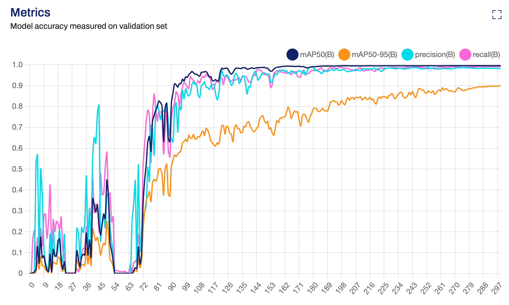
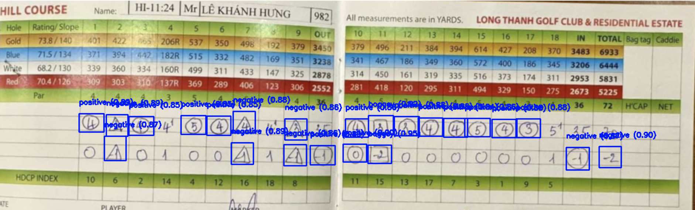
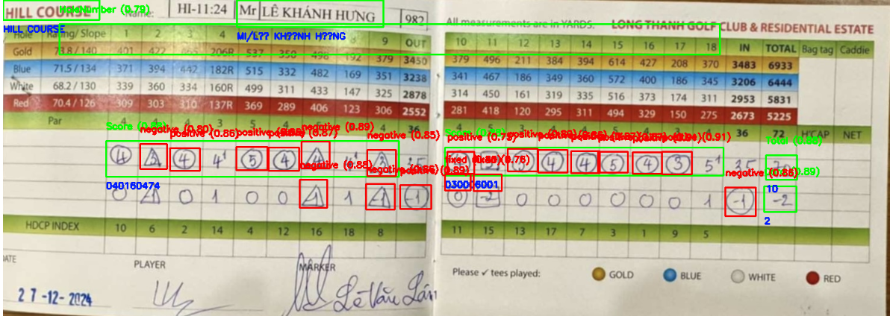

# Golf Scorecard Scanner

This solution uses **YOLOv8 and YOLOv11** for field detection, **VietOCR** for text recognition, and **LabelMe** for annotation. It processes complex golf scorecard layouts and structures them into a JSON file for further analysis. Optionally, it incorporate Flash Vision API for direct parsing of data reading in case data cannot be accurate or sustainable.

---

## **Project Overview**
This solution:
1. Detects fields (e.g., PlayerName, CourseName, Score ...) using **YOLOv8** and **YOLOv11** large models.
2. Recognizes text using **VietOCR** tailored for Vietnamese handwriting, with back up verification using **Qwen2.5-VL** model. Using PyTesseract OCR to specialize detecting numeric values only.
3. Opt in customized **MNIST CRNN** model for handwriting numeric recognition
3. Handles multiple layouts/templates dynamically.
4. Extracts structured data and exports it to a JSON file.
5. Uses **LabelMe** for annotating golf scorecard fields.  
**Optionally:** 
- Use Flash Vision API with provided script and instruction in this project for direct data extraction.  
- Use Open AI API to extract data (this will need pricing optimization and resource management). Calculation to be: Cost per image = (100/1M)× price per 1M tokens. Since it's estimated that we are using approximately 100-200 tokens for each call individually, with cost on average of $2.5 USD per 1M tokens. Find more at [Open AI Integration Pricing](https://openai.com/api/pricing/).

---

## **Project Constraints**
1. The scorecards primarily contain handwritten information that needs to be accurately interpreted.

2. Symbols, such as a triangle (△) or circle (〇), have specific meanings: an empty triangle represents a value of -1, while a triangle containing a number (e.g., 2 or -2) reflects the explicitly stated value. Circles indicate positive values regardless of whether the number is inside or outside.

3. Slots that are completely blackened, deleted, or scratched out should be treated as empty fields.

4. Numbers that have been hand-corrected, such as changing a 1 to a 7, should be detected and interpreted correctly.

5. Each golf course or location may have distinct scorecard formats, affecting the layout of fields and requiring adaptable contour detection and grid labeling.

6. Some locations have multiple courses, such as "Course A", "Course B", or names like "West", "East", "South", or "North". The system must identify which course corresponds to the entered values for each user.

7. Scorecards typically list multiple users, and the system must detect and assign names and corresponding scores accurately for each individual.

8. Additional fields may exist on certain scorecards, such as "Hole" or "HDC (Handicap)", and column headers might vary (e.g., "Total", "Net"). These variations must be accounted for during processing.

9. The text on the scorecards is written in Vietnamese, necessitating the use of the VietOCR model for accurate text recognition.

---

## **1. Setting Up the Environment**

### Install Required Libraries
Install all required libraries with:
```bash
pip install -r requirements.txt
```

---

## **2. Directory Structure**
Organize the project as follows:
```plaintext
GolfScorecardScanner/
├── dataset/
│   ├── crop/
│       ├── PlayerName/
│       ├── CourseName/
│       ├── Score/
│       ├── ... (other field labels that are cropped)
│   ├── labels/                    # LabelMe JSON files
│       ├── train/
│       ├── val/
│   ├── images/                    # Source images
│       ├── train/
│       ├── val/
│   ├── config.yaml                # YOLO configuration file
├── symbol/                        # Directory training symbol detection, this has similar set-up to dataset folder
├── data_line/                     # Large folder containing dataset to train OCR based text recognition
├── models/                        # Pre-trained models
│   ├── yolov8l.pt                 # YOLOv8 large model
│   ├── yolov11l.pt                # YOLOv11 large model
│   ├── yolov11lsymbol.pt          # YOLOv11 large model for symbol detection
│   ├── mnistrcnn_m1.keras         # MNIST CRNN model 
│   ├── mnist_crnn_yolov11s.pt     # MNIST YOLO model
├── output/                        # JSON output files
├── scripts/                       # Detection, recognition, and export scripts (UI)
│   ├── detect_fields.py
│   ├── recognize_text.py
│   ├── generate_json.py
│   ├── utils.py
├── train/                         # YOLO OBB Training scripts and configurations
│   ├── yolo_train.py
│   ├── hyp.yaml
├── labelling/                     # Scripts aid in Flash Vision API detection
│   ├── thicken_grid.py            # Script that thicken the grid for better data extraction
│   ├── auto_label.py              # Script to extract data from input images into JSON using Flash Vision API
│   ├── convert_json_to_yolo.py    # Script directly convert necessitated fields from JSON file into txt format for YOLO training
│   ├── visualize_labels_from_json.py # Script visualize debug image detected from Flash Vision JSON file
│   ├── visualize_labels_from_json.py # Script visualize debug image detected from YOLO txt conversion
├── key/                           # Your credential key from Google Flash Vision
├── data/                          # Input and output directory from using Flash Vision
│   ├── train/                     # All be used for training
│       ├── debug_label/           # Visualized images
│       ├── images/                # Source of input
│       ├── labels/                # Output labels in JSON
│       ├── yolo_labels/           # Output labels in txt
│       ├── processed_images/      # Output img with grid thickened
├── mnist/                         # Scripts used for digit training with MNIST CRNN
│   ├── synthetic_digit.py         # Create synthetic mnist data
│   ├── preprocess_augmentation.py # preprocess and apply augmentation 
│   ├── visualize_preprocess.py    # Visualization
│   ├── load_and_split.py          # Load data and split to train/test sets
│   ├── prepare_label.py           # Prepare labelling for CTC loss
│   ├── build_and_train_model.py   # Build and config training model for MNIST CRNN
├── synthetic_digits/              # Dataset of CSV, image and labels synthetically created
├── processed_digits/              # Dataset of synthetic CSV, image and labels that is processed
├── GolfScorecardScanner.ipynb     # Notebook for all procedures
├── main.py                        # Main pipeline script
```

---

## **3. Annotating Data with LabelMe**
1. Use **LabelMe** for annotating fields in golf scorecards:
   ```bash
   labelme dataset/src/
   ```
2. Save annotations in `dataset/labels/` as JSON files.

3. Convert LabelMe annotations to YOLO format:
   ```bash
   python scripts/convert_labelme_to_yolo.py
   ```

---

## **4. Training YOLO for Field Detection**

### Data Preparation
1. Organize your dataset:
```plaintext
├── dataset/
│   ├── crop/
│       ├── PlayerName/
│       ├── CourseName/
│       ├── Score/
│       ├── ... (other field labels that are cropped)
│   ├── labels/          
│       ├── train/
│       ├── val/
│   ├── images/          
│       ├── train/
│       ├── val/
```

### Training
Example script training the YOLO model:
```bash
yolo task=detect mode=train data=dataset/config.yaml model=yolov8l.pt epochs=100 imgsz=640
```
You can change configs from the pre-configured options below:

### **YOLOv8l:**  
#### a. Configuration:  
```yaml
batch: 32                 # Specific batch size
cache: "ram"              # Use RAM for caching
device: "0"
epochs: 300               # Train for more epochs
imgsize: 640              
patience: 30              # Early stopping after 30 epochs of no improvement (optional)
lr0: 0.001                # Learning rate for stability
optimizer: "AdamW"        # Use AdamW optimizer
augment: True             # Enable advanced augmentations
weights: "yolov8l.pt"     # Start with pretrained weights
```

#### b. Model Evaluation:  
    

---

### **YOLOv11l**
#### a. Configuration:  
```yaml
batch: 32                 # Specific batch size
cache: "ram"              # Use RAM for caching
device: "gpu"    
epochs: 300               # Train for more epochs
imgsize: 640              
patience: 30              # Early stopping after 30 epochs of no improvement (optional)
lr0: 0.001                # Learning rate for stability
optimizer: "AdamW"        # Use AdamW optimizer
augment: True             # Enable advanced augmentations
weights: "yolov11l.pt"    # Start with pretrained weights
```

#### b. Model Evaluation:  
   

---

### Reflection on the Evaluation Graphs for YOLOv8l and YOLOv11l

#### a. **Comparison of mAP50 and mAP50-95**
   - **YOLOv8l:**
     - The mAP50 (blue line) shows a steady increase and stabilizes near 0.9 after 50 epochs. 
     - mAP50-95 (orange line) has a slower growth curve and plateaus around 0.65 after 90 epochs. This reflects moderate performance across varying IoU thresholds.
   - **YOLOv11l:**
     - The mAP50 reaches a higher value (~0.93) and stabilizes earlier compared to YOLOv8l, indicating stronger performance for IoU=0.5.
     - mAP50-95 grows more steadily and achieves a final value of ~0.8, significantly outperforming YOLOv8l. This suggests YOLOv11l generalizes better across different IoU thresholds.

#### b. **Precision and Recall**
   - **YOLOv8l:**
     - Precision (cyan line) increases steadily but fluctuates after epoch 30, stabilizing near 0.85. 
     - Recall (magenta line) grows steadily and stabilizes close to 0.87, indicating a balanced performance between finding true positives and avoiding false negatives.
   - **YOLOv11l:**
     - Precision stabilizes at a higher level (~0.9) compared to YOLOv8l. The consistent high precision shows YOLOv11l is more confident in its predictions.
     - Recall is slightly lower (~0.88), but it consistently improves over the epochs, indicating the model captures most relevant instances effectively.

#### c. **Training Epochs and Stability**
   - **YOLOv8l:**
     - Stabilizes after 70 epochs, but precision and mAP50-95 plateau at lower values than YOLOv11l, suggesting potential underfitting for complex data structures.
   - **YOLOv11l:**
     - Requires more training epochs (~150-200) to stabilize. However, the final metrics (mAP50, mAP50-95, precision, recall) are significantly higher, demonstrating better learning and performance.

#### d. **Model Complexity and Generalization**
   - YOLOv8l is less complex, requiring fewer epochs to train but sacrifices generalization (lower mAP50-95 and precision).
   - YOLOv11l, with higher complexity, learns more intricate features, evident in higher precision and mAP50-95, making it more suitable for nuanced and varied datasets like golf scorecards.

#### e. **Recommendations**
   - **YOLOv8l:** Suitable for faster inference with acceptable accuracy. Use for real-time applications or less complex layouts.
   - **YOLOv11l:** Better for high-accuracy requirements, especially when handling multiple templates or challenging layouts, but may require more computational resources and training time.

In conclusion, the evaluation graphs indicate that while YOLOv8l provides faster convergence and decent accuracy, YOLOv11l outperforms it in precision, recall, and generalization, making it the preferred model for complex field detection tasks.

---

## **5. Field Detection Script**
`detect_fields.py`:
```python
    # Load the YOLO model
    model = YOLO(model_path)
    # Run the model on the input image
    results = model(image_path)
    # Load the image for visualization
    image = cv2.imread(image_path)
    if image is None:
        print(f"Error: Unable to load image from {image_path}")
        return
    # Iterate through the detected fields
    for result in results[0].boxes.data:
        x1, y1, x2, y2, conf, cls = result.tolist()
        label = model.names[int(cls)]
        # Draw a rectangle around the detected field
        cv2.rectangle(image, (int(x1), int(y1)), (int(x2), int(y2)), (0, 255, 0), 2)
        # Put the label and confidence above the rectangle
        cv2.putText(image, f"{label} {conf:.2f}", (int(x1), int(y1) - 10),
                    cv2.FONT_HERSHEY_SIMPLEX, 0.5, (0, 255, 0), 2)
```  
This script is intended to be used for both debugging and field arrangement purposes. 
Average processing time can be varied based on your device, prediction on a Macbook Pro M1 averaging from 4 to 15 seconds for YOLOv8l model and 6 to 9 seconds on YOLOv11l model.  

#### Prediction Example:
**YOLO v8l on IMG_9475:**  
  
Example Output:    
```
image 1/1 /Users/khoale/Downloads/GolfScoreCardScanner/dataset/images/train/IMG_9475.JPG: 480x640 4 PlayerNames, 2 CourseNames, 8 Scores, 8 Totals, 2 HoleNumbers, 1663.9ms
Speed: 14.6ms preprocess, 1663.9ms inference, 3.8ms postprocess per image at shape (1, 3, 480, 640)
```  

**YOLO v11l on IMG_9475:**  
  
Example Output:  
```
image 1/1 /Users/khoale/Downloads/GolfScoreCardScanner/dataset/images/train/IMG_9475.JPG: 480x640 4 PlayerNames, 2 CourseNames, 8 Scores, 8 Totals, 2 HoleNumbers, 772.2ms
Speed: 8.3ms preprocess, 772.2ms inference, 1.9ms postprocess per image at shape (1, 3, 480, 640)
```  

---

## **6. Text Recognition with VietOCR (for alphabetics) and TesseractOCR (for numerics)**
1. Use **VietOCR** to recognize Vietnamese text in each detected field.

### Script
`recognize_text.py`:
```python
def load_vietocr_model(vietocr_model_path):
    """Load VietOCR model for text recognition."""
    config = Cfg.load_config_from_name('vgg_transformer')
    config['weights'] = vietocr_model_path
    config['device'] = 'cpu'  # Change to 'cuda' if GPU is available
    config['predictor']['beamsearch'] = False
    return Predictor(config)

def recognize_text(image, model):
    """Recognize text from an image."""
    pil_image = Image.fromarray(image)
    return model.predict(pil_image)

def recognize_numeric_text(image):
    """Recognize numeric text using Tesseract OCR in numeric-only mode."""
    config = r'--psm 6 -c tessedit_char_whitelist=0123456789'
    text = pytesseract.image_to_string(image, config=config)
    return text.strip()
```  

This script is inherited from:  
- scripts/detect_fields.py 
- labelling/thicken_grid.py  
**Evaluation:** Some alphabetic-characters can be misunderstood and detected to be numeric, for numeric-only-fields (Score, Net and Total), we integrate Tesseract OCR to detect and extract only numeric values (e.g., 0-9).

**vgg_transformer model on predicting IMG_9475 with YOLOv11l:**  
Debugged values:  
```
Detected field: CourseName, Confidence: 0.91, Text: ĐƯỜNG QUẾ (A)/CINNAMON COURSE (A)
Detected field: PlayerName, Confidence: 0.90, Text: Ning
Detected field: CourseName, Confidence: 0.89, Text: ĐƯỜNG CỌ (B)/PALM COURSE (B)
Detected field: Total, Confidence: 0.89, Text: 0
Detected field: Total, Confidence: 0.89, Text: 2
Detected field: Total, Confidence: 0.89, Text: 2
Detected field: Total, Confidence: 0.89, Text: 0
Detected field: Total, Confidence: 0.88, Text: 13
Detected field: PlayerName, Confidence: 0.88, Text: KH/X
Detected field: HoleNumber, Confidence: 0.88, Text: DƯƠNG QUIF NAMON COURSE VIÊN 5
Detected field: HoleNumber, Confidence: 0.88, Text: DUONOCOLFO/MOURSE36/4.5
Detected field: Total, Confidence: 0.88, Text: 15
Detected field: PlayerName, Confidence: 0.87, Text: KON
Detected field: Total, Confidence: 0.87, Text: A1
Detected field: Total, Confidence: 0.86, Text: 18
Detected field: Score, Confidence: 0.84, Text: 122311Z25
Detected field: Score, Confidence: 0.83, Text: 12203217
Detected field: Score, Confidence: 0.83, Text: vosuates
Detected field: Score, Confidence: 0.83, Text: 030021246
Detected field: PlayerName, Confidence: 0.82, Text: OLUGIC
Detected field: Score, Confidence: 0.82, Text: 037321240
Detected field: Score, Confidence: 0.75, Text: 03602121202122222
Detected field: Score, Confidence: 0.67, Text: 02124202122247
Detected field: Score, Confidence: 0.40, Text: oss10012
```   

Visualization:  
  

**Evaluation:** Predicted text may not being correct due to user poor handwriting. Improve handwriting for better accuracy.  

---
## **7. Usage of Qwen2.5-VL for Text Validation (with prompt)**
With the bbox detected for the `PlayerName` class by YOLOv11l model, we crop the sections, and predict with **VietOCR** and **PaddleOCR** (optional for a backup in case VietOCR may fails). Using the text prediction and cropped image results previously, we prompt Qwen for validation and fine-tuning.  

Example usage of pipeline integrating **VietOCR** and **PaddleOCR** with **Gwen** for validation:
```python
if label == "PlayerName":
    # Prior 1 using VietOCR
    vietocr_result = recognize_text(field_image, vietocr_model)
    vietocr_result_cleaned = clean_text(vietocr_result)
    vietocr_result_formated = format_output(label, vietocr_result_cleaned)
    # Prior 2 using PaddleOCR
    paddle_result = paddle_text(field_image)
    paddle_result_cleaned = clean_text(paddle_result)
    paddle_result_formated = format_output(label, paddle_result_cleaned)
    # Prior 3 support with Qwen
    qwen_result = qwen_text(field_image, vietocr_result_formated, paddle_result_formated)
    text = qwen_result
```

Using Gwen with Huggingface API inference to request prompt and get response from Gwen model (specific):  
```python
from huggingface_hub import InferenceClient
import json
import base64
import requests
import time
# Authenticate programmatically (your Hugging Face token can be found at Settings / Acess Token)
API_URL = "https://api-inference.huggingface.co/models/Qwen/Qwen2.5-72B-Instruct"  # Large model for general
HUGGING_FACE_TOKEN = "your-api-token"
HEADERS = {
    "Authorization": f"Bearer {HUGGING_FACE_TOKEN}",
    "Content-Type": "application/json"
}
max_retries = 10 # change allowance
attempt = 1      # counter at index 1
# Predict
def qwen_text(image, vietocr_result, paddle_result):
    """
    Perform text recognition using Qwen2.5 through Hugging Face Inference API.
    :param image: Input image (as a NumPy array).
    :return: Recognized text as a string.
    """
    # Convert the image to RGB if necessary
    if len(image.shape) == 2:  # Grayscale
        image = cv2.cvtColor(image, cv2.COLOR_GRAY2RGB)
    elif image.shape[2] == 4:  # RGBA to RGB
        image = cv2.cvtColor(image, cv2.COLOR_RGBA2RGB)
    # Convert to PIL Image for Qwen processor
    pil_image = Image.fromarray(image)
    # Prepare the input prompt (JSON) and attach the image
    with open("temp_image.jpg", "wb") as temp_file:
        pil_image.save(temp_file, format="JPEG")
    # Combine the image (Base64) and prompt into a single string input
    with open("temp_image.jpg", "rb") as image_file:
        encoded_image = base64.b64encode(image_file.read()).decode("utf-8")
    # Build the Qwen prompt
    if vietocr_result.strip():
        print(f"VietOCR predict this text, as {vietocr_result}, continue with Qwen verification...")
        prompt = (
            f"data:image/jpeg;base64,{encoded_image}\n"
            f"Extract and verify the player names from the image below. The prediction is '{vietocr_result}'. "
            f"If the name contain 'A' or 'A.' at the beginning, following by the name, strip that out. If not, skip it. We only keep the name after the 'A' initial. "
            f"Only if the name is any of the following 'An', 'Anh', 'Ánh', 'Ảnh', 'Ân', 'Ái', then the name would not stripping out the first 'A' initial. "
            f"The name is in Vietnamese. Correct or validate the prediction and return only the names in a concise. If the name doesn't match Vietnamese language, try to find the closest name, you cannot leave this as No Name or None etc, try to find the closest match. "
            f"You are prompted to provide the final answer in this format: "
            f"final_answer: name "
            f"No more lines or texts after this line could be provided after the above final_answer result as this already meant to be the last line of the response."
        )
        USING_API = API_URL
    elif  paddle_result.strip():
        print(f"PaddleOCR predict this text, as {paddle_result}, continue with Qwen verification...")
        prompt = (
            f"data:image/jpeg;base64,{encoded_image}\n"
            f"Extract and verify the player names from the image below. The prediction is '{paddle_result}'. "
            f"If the name contain 'A' or 'A.' at the beginning, following by the name, strip that out. If not, skip it. We only keep the name after the 'A' initial. "
            f"Only if the name is any of the following 'An', 'Anh', 'Ánh', 'Ảnh', 'Ân', 'Ái', then the name would not stripping out the first 'A' initial. "
            f"The name is in Vietnamese. Correct or validate the prediction and return only the names in a concise. If the name doesn't match Vietnamese language, try to find the closest name, you cannot leave this as No Name or None etc, try to find the closest match. "
            f"You are prompted to provide the final answer in this format: "
            f"final_answer: name "
            f"No more lines or texts after this line could be provided after the above final_answer result as this already meant to be the last line of the response."
        )
        USING_API = API_URL
    else: # Models cannot detect text so using Gwen OCR based model
        print("None of OCR model can predict this text, continue with Qwen extraction...")
        prompt = (
            f"data:image/jpeg;base64,{encoded_image}\n"
            f"Extract all valid player names from the image below in Vietnamese language. "
            f"If names cannot be detected, provide the best possible attempt at reading text correctly. "
            f"You are prompted to provide the final answer in this format below: "
            f"final_answer: name "
            f"No more lines or texts after this line could be provided after the above final_answer result as this already meant to be the last line of the response."
        )
        USING_API = "https://api-inference.huggingface.co/models/Qwen/Qwen2-VL-7B-Instruct"
    payload = {"inputs": prompt}
    # Send the POST request (attempt {allowance} time if not responding, else quit)
    for attempt in range(max_retries):
        response = requests.post(
            USING_API,
            headers=HEADERS,
            data=json.dumps(payload),
            timeout=90
        ) # Above set time out to 90s, large model could be busy so terminate the query without response after 90s
        # Handle and parse the response
        if response.status_code == 200:
            result = response.json()
            if isinstance(result, list) and len(result) > 0:
                # Assuming the generated text is in the first dictionary of the list
                text = result[0].get("generated_text", "")
                print(f"Qwen response with {text}") # Debug (should be commented)
                attempt = 1 # Reset
                cleaned = clean_qwen_response(text)
                return qwen_find_name(cleaned) # Filtering out base response and match closest name
            else:
                print("Unexpected API response format.")
        elif attempt < max_retries - 1:
            attempt += 1 # Raise attempt counter
            print(f"Cannot catch response from Qwen server, this is the attempt {attempt}/{max_retries} sleep for 5s...")
            time.sleep(5)  # Wait 5 seconds before retrying
        else:
            print(f"Error {response.status_code}: {response.text}") # Iterate these as print error instead of raising error to allow the stream continue until allowance exhausted
    print(f"Failed after {max_retries} attempts. Last response: {response.text}")
    return "Qwen cannot process this text"
```     
However, Gwen response would likely being low accurate, and irrelevant, therefore, we need to fine-tune it. Firstly, filtering out redundant body from response. Example usages:
```python
def clean_qwen_response(response_text):
    # Use regex to find all occurrences of 'final_answer' with the correct format
    matches = re.findall(r"final_answer:\s*([a-zA-ZÀ-ỹ\s]+)", response_text, re.DOTALL)
    if matches:
        # Get the last match and clean it further
        final_name = matches[-1].strip()
        # Remove "final" or "final_answer" from the extracted name, if present
        clean_name = re.sub(r"\b(final|final_answer)\b", "", final_name, flags=re.IGNORECASE).strip()
        return clean_name
    else:
        # Return a placeholder if no valid 'final_answer' is found
        return "[Name cannot be found, try again]"
```

Optionally, we can find the closest matching Vietnamese name in case the prediction could sightly off. We can build prompt query such as this:  
```python
attempt_find = 1 # Prefix
def qwen_find_name(name):
    #### With OCR assistance
    print("Qwen attempting to find the closest Vietnamese name...")
    prompt = (
        f"Given this name: '{name}'. "
        f"You will have to examine whether the name '{name}' is a Vietnamese langugage - name. "
        f"If it doesn't seem like a Vietnamese name, try to provide a Vietnamese name that matches the most with this name, for instance the name Hæn is closest to the name Hân. "
        f"If you think this name is a Vietnamese name already, just return the name. "
        f"You are prompted to provide the final answer in this format: "
        f"final_answer: name "
        f"No more lines or texts after this line could be provided after the above final_answer result as this already meant to be the last line of the response."
    )
    # Load and construct prompt
    payload = {"inputs": prompt}
    # Send the POST request (attempt {allowance} time if not responding, else quit)
    for attempt_find in range(max_retries):
        response = requests.post(
            API_URL,
            headers=HEADERS,
            data=json.dumps(payload),
            timeout=90
        ) # Above set time out to 90s, large model could be busy so terminate the query without response after 90s
        # Handle and parse the response
        if response.status_code == 200:
            result = response.json()
            if isinstance(result, list) and len(result) > 0:
                # Assuming the generated text is in the first dictionary of the list
                text = result[0].get("generated_text", "")
                print(f"Qwen-find-name response with {text}") # Debug (should be commented)
                attempt_find = 1 # Reset
                return clean_qwen_response(text) # Filtering out base response
            else:
                print("Unexpected API response format.")
        elif attempt_find < max_retries - 1:
            attempt_find += 1 # Raise attempt counter
            print(f"Cannot catch response from Qwen server, this is the attempt {attempt_find}/{max_retries} sleep for 5s...")
            time.sleep(5)  # Wait 5 seconds before retrying
        else:
            print(f"Error {response.status_code}: {response.text}") # Iterate these as print error instead of raising error to allow the stream continue until allowance exhausted
    print(f"Failed after {max_retries} attempts. Last response: {response.text}")
    return name # Cannot process so return base name
```

---

## **8. Digit Recognition with MNIST CRNN**
Find more on the procedures to train MNIST CRNN model for handwritten digit recognition via [MNIST CRNN](https://github.com/Lelekhoa1812/Golf-Scorecard-Scanner/blob/main/mnist/README.md).

---

## **9. Handling Constraints**
### **Symbols Parsing (Constraint 2)**

Symbols like `△` (triangle) and `〇` (circle) `□` (square) require custom parsing:
1. **△ (Triangle)**: Represents a negative score (triple bogey) unless a number is inside.
2. **〇 (Circle)**: Represents a positive score (birdie) with or without numbers inside.
3. **□ (Square)**: Represents a bogey or +1 unless with specific number of plus point inside.
4. **Positive (+)**: Detect positive entries separately to avoid confusion to the main score number.
5. **Negative (-)**: Detect negative entries separately to avoid confusion to the main score number.

YOLOv11l model was utilized to detect these symbols, evaluation:  
   

Symbol Detection model on IMG_9425:  
 

Then further progress will try to extract the value inside these symbol
---

### **Uncertainties & Corrections (Constraints 3 & 4)**

- Detect **scratches/blackened slots** using a confidence threshold from YOLOv11l model (yolov11lsymbol.pt).
- **Corrected numbers**: Use contour analysis to detect overlayed characters and apply probabilistic matching.

---

### **Dynamic Templates (Constraints 5, 6, 8)**

- **YOLO OBB** handles varying layouts by training on diverse templates and using oriented bounding boxes.
- **Dynamic Mapping**: A dictionary maps detected labels to standard fields (e.g., "Net" ↔ "Total").

**Dynamic Template Mapping Example**:
```python
TEMPLATE_MAP = {
    "course_a": {"PlayerName": "User", "Total": "Net"},
    "course_b": {"HDC": "Handicap", "Score": "Points"}
}

def map_fields(fields, template):
    mapped_fields = {}
    for field in fields:
        mapped_label = TEMPLATE_MAP.get(template, {}).get(field["label"], field["label"])
        mapped_fields[mapped_label] = field
    return mapped_fields
```

This currently handled in utils.py.  

---

### **Multiple Users (Constraint 7)**

Each user's name and data are extracted separately. YOLO detects user names by assigning a "PlayerName" label. A dictionary organizes data for each user.

---

### **Vietnamese OCR (Constraint 9)**

VietOCR recognizes Vietnamese handwriting effectively, especially when fine-tuned on scorecards.

---

## **10. JSON Output Generation**
Combine detection and recognition results into a structured JSON file:
`generate_json.py`:
```python
import json

def generate_json(fields, texts, output_file="output/result.json"):
    result = {field["label"]: text for field, text in zip(fields, texts)}
    with open(output_file, "w") as f:
        json.dump(result, f, indent=4)
```

---

## **11. Google Flash API for Annotation**
### Setting Up Flash API
1. Install **Google Cloud Vision**:
   ```bash
   pip install google-cloud-vision
   ```
2. Use Flash API to label data, example usages:
   ```python
   from google.cloud import vision

   client = vision.ImageAnnotatorClient()

   def label_image(image_path):
       with open(image_path, "rb") as img_file:
           content = img_file.read()
       image = vision.Image(content=content)
       response = client.text_detection(image=image)
       return response.text_annotations
   ```
    Or for more details and complete usage, [visit](https://github.com/Lelekhoa1812/Golf-Scorecard-Scanner/blob/main/dataset/auto_label.py)


---

## **12. Flask Deployment**
Deploy with Flask for scalable usage:
```python
from flask import Flask, request, jsonify
from detect_fields import detect_fields
from recognize_text import recognize_text

app = Flask(__name__)

@app.route('/process', methods=['POST'])
def process_scorecard():
    image = request.files['file']
    fields = detect_fields(image)
    texts = [recognize_text(field) for field in fields]
    return jsonify({"fields": fields, "texts": texts})

if __name__ == "__main__":
    app.run(debug=True)
```

---

Find more at [Notebook](https://github.com/Lelekhoa1812/Golf-Scorecard-Scanner/blob/main/GolfScorecardScanner.ipynb).  
Visualizing Overall Detection Sketch on IMG_9425:  
    

---

LATEST UPDATE ON 9 jan 2024. 
AUTHOR: DANG KHOA LE (LIAM)