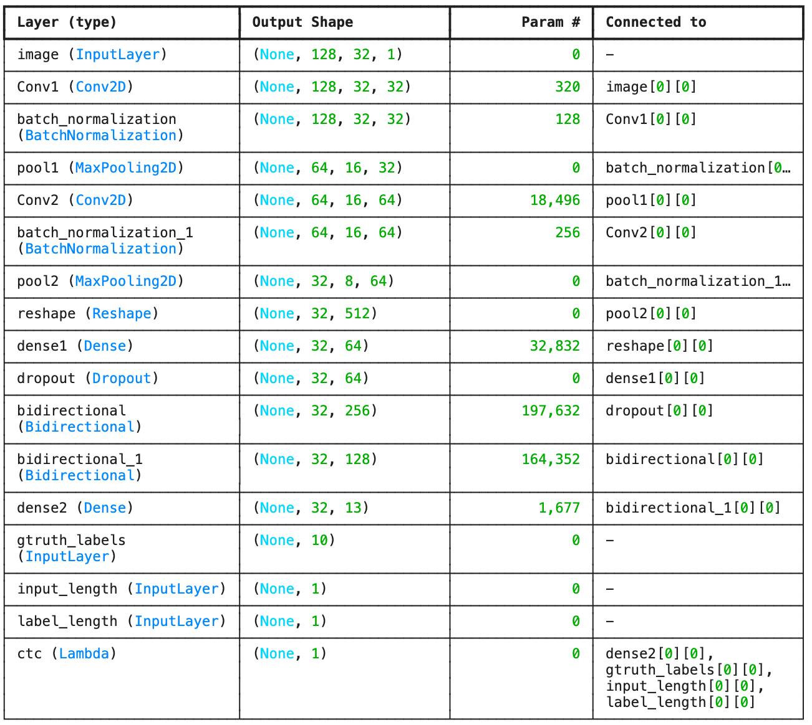

# MNIST Digits Recognition and Processing Pipeline
This project implements a pipeline for recognizing multi-digit handwritten sequences using the MNIST dataset. It covers synthetic data generation, preprocessing, augmentation, and building a recognition model with CTC loss.  
Optionally, we also provide setups and configs to train MNIST model with pre-trained YOLOv11 classify model (using Ultralytics MNIST dataset with 70k sample).

---

## Steps Overview
### 1. **Create Synthetic Data**
This step combines the MNIST dataset with an external digit dataset to create synthetic multi-digit sequences.
- Randomly select digits and transform them.
- Create sequences of digits with labels.
- Save images and labels for further processing.

[Script](https://github.com/Lelekhoa1812/Golf-Scorecard-Scanner/blob/main/mnist/synthetic_digit.py)

---

### 2. **Preprocessing and Augmentation (Optional)**

Preprocessing ensures that all images conform to the input size of the model, and augmentation adds realistic distortions to simulate real-world conditions.

- Resize and normalize images.
- Add random blobs and noise for augmentation.
- Save processed images and flattened CSV data for training.

[Script](https://github.com/Lelekhoa1812/Golf-Scorecard-Scanner/blob/main/mnist/preprocess_augmentation.py)

---

### 3. **Visualization (Optional)**

Visualize the processed images to ensure proper preprocessing and labeling.

- Reconstruct images from flattened data.
- Display images with corresponding labels using Matplotlib.

Example:    
   

[Script](https://github.com/Lelekhoa1812/Golf-Scorecard-Scanner/blob/main/mnist/visualize_preprocess.py)

---

### 4. **Load and Split Train/Test Set**

Split the processed dataset into training and validation sets.

- Read processed images and labels.
- Resize images to model-compatible dimensions.
- Normalize image data and split into train/test sets.

Example Output:
```
Number of images found:  13002
Number of labels found:  13002
Number of unique characters:  10
Characters present:  {'3', '4', '2', '5', '9', '0', '7', '8', '6', '1'}

train_size 10401   valid_size 2601

 train_x.shape (10401, 128, 32, 1)

 valid_x.shape (2601, 128, 32, 1)

 Example of label_valid 7988588
```  
   

[Script](https://github.com/Lelekhoa1812/Golf-Scorecard-Scanner/blob/main/mnist/load_and_split.py)  

---

### 5. **Prepare Labels for CTC Loss**

Convert labels to numeric form and prepare them for training using the CTC loss function.

- Define an alphabet for numeric labels.
- Convert string labels to numeric sequences.
- Configure `train_y`, `train_label_len`, `train_input_len`, and other inputs.

Example Output:
```
Example Train Label: 0009363
Train Label Encoded: [ 0.  0.  0.  9.  3.  6.  3. -1. -1. -1.]
Train Label Length: [7.]
Train Input Length: [30.]
Example Valid Label: 7997293
Valid Label Encoded: [ 7.  9.  9.  7.  2.  9.  3. -1. -1. -1.]
Valid Label Length: [7.]
Valid Input Length: [30.]
```  

[Script](https://github.com/Lelekhoa1812/Golf-Scorecard-Scanner/blob/main/mnist/prepare_label.py)

---

### 6. **Build and Train MNIST CRNN Model**

Build an CRNN model for sequence recognition using convolutional layers, LSTMs, and CTC loss.

- Define the architecture with CNNs for feature extraction and RNNs for sequential learning.
- Use CTC loss for alignment between predictions and ground truth.
- Train the model with early stopping.

There are 2 models:
- The final with CTC is for training. 
- The functional is for saving and predicting.

#### Statistics on setup of the MNIST model:  
   

#### Statistics on Training (Last 5 epochs):  
```
Epoch 56/60
82/82 ━━━━━━━━━━━━━━━━━━━━ 0s 374ms/step - loss: 0.3717
Epoch 56: ReduceLROnPlateau reducing learning rate to 6.24999984211172e-06.
82/82 ━━━━━━━━━━━━━━━━━━━━ 33s 398ms/step - loss: 0.3718 - val_loss: 0.5261 - learning_rate: 1.2500e-05
Epoch 57/60
82/82 ━━━━━━━━━━━━━━━━━━━━ 33s 399ms/step - loss: 0.3866 - val_loss: 0.5166 - learning_rate: 6.2500e-06
Epoch 58/60
82/82 ━━━━━━━━━━━━━━━━━━━━ 33s 401ms/step - loss: 0.3955 - val_loss: 0.5244 - learning_rate: 6.2500e-06
Epoch 59/60
82/82 ━━━━━━━━━━━━━━━━━━━━ 0s 387ms/step - loss: 0.3703
Epoch 59: ReduceLROnPlateau reducing learning rate to 3.12499992105586e-06.
82/82 ━━━━━━━━━━━━━━━━━━━━ 34s 411ms/step - loss: 0.3704 - val_loss: 0.5227 - learning_rate: 6.2500e-06
Epoch 60/60
82/82 ━━━━━━━━━━━━━━━━━━━━ 33s 401ms/step - loss: 0.3974 - val_loss: 0.5185 - learning_rate: 3.1250e-06
```

Find more at:  
[Script](https://github.com/Lelekhoa1812/Golf-Scorecard-Scanner/blob/main/mnist/build_and_train_model.py)

---

### 7. **Build and Train MNIST CRNN Model**
Sample Validation (on valid_x):
```
82/82 ━━━━━━━━━━━━━━━━━━━━ 3s 28ms/step

 decoded [[ 7  9  8 ... -1 -1 -1]
 [ 7  9  8 ... -1 -1 -1]
 [ 7  9  8 ... -1 -1 -1]
 ...
 [ 9  9  9 ... -1 -1 -1]
 [ 9  9  9 ... -1 -1 -1]
 [ 9  9  9 ... -1 -1 -1]]

 predict 7985418
Correct characters predicted : 97.70%
Correct words predicted      : 86.27%
```   

Sample Test: 
   


**Conclusion**: The model came up with a very high accuracy of prediction with 97.70% of the characters (singular) asserted correctly and 86.27% words are predicted accurately.

Find more at:  
[Script](https://github.com/Lelekhoa1812/Golf-Scorecard-Scanner/blob/main/mnist/validation_test.py)
---

### 8. **Train MNIST with Ultralytics Inference**
```python
hub.login('your-end-point')

model = YOLO('https://hub.ultralytics.com/models/a5pvF71mXamlnxKYJAVN')
results = model.train()
```

You can also train MNIST with YOLOv11n inference via Ultralytics Hub.   

#### Statistics on Training (Last 5 epochs):  
  Epoch    GPU_mem       loss  Instances       Size
      56/60      6.14G    0.03703         32        640: 100%|██████████| 1875/1875 [05:30<00:00,  5.67it/s]
               classes   top1_acc   top5_acc: 100%|██████████| 157/157 [00:31<00:00,  4.97it/s]                   all      0.994          1


      Epoch    GPU_mem       loss  Instances       Size
      57/60      6.13G     0.0361         32        640: 100%|██████████| 1875/1875 [05:35<00:00,  5.59it/s]
               classes   top1_acc   top5_acc: 100%|██████████| 157/157 [00:30<00:00,  5.12it/s]                   all      0.994          1

      Epoch    GPU_mem       loss  Instances       Size
      58/60      6.15G    0.03384         32        640: 100%|██████████| 1875/1875 [05:36<00:00,  5.57it/s]
               classes   top1_acc   top5_acc: 100%|██████████| 157/157 [00:31<00:00,  4.95it/s]
                   all      0.995          1

      Epoch    GPU_mem       loss  Instances       Size
      59/60      6.13G    0.03215         32        640: 100%|██████████| 1875/1875 [05:34<00:00,  5.60it/s]
               classes   top1_acc   top5_acc: 100%|██████████| 157/157 [00:30<00:00,  5.10it/s]                   all      0.995          1


      Epoch    GPU_mem       loss  Instances       Size
      60/60      6.14G    0.03228         32        640: 100%|██████████| 1875/1875 [05:33<00:00,  5.62it/s]
               classes   top1_acc   top5_acc: 100%|██████████| 157/157 [00:31<00:00,  4.94it/s]                   all      0.995          1

#### Evaluation of Loss on Training:  
   


## Directory Structure

```
GolfScoreCardScanner/
├── mnist/                         # Scripts used for digit training with MNIST CRNN
│   ├── synthetic_digit.py         # Create synthetic mnist data
│   ├── preprocess_augmentation.py # preprocess and apply augmentation 
│   ├── visualize_preprocess.py    # Visualization
│   ├── load_and_split.py          # Load data and split to train/test sets
│   ├── prepare_label.py           # Prepare labelling for CTC loss
│   ├── build_and_train_model.py   # Build and config training model for MNIST CRNN
│   ├── validation_test.py         # Some validation of model prediction on test set
├── synthetic_digits/              # Dataset of CSV, image and labels synthetically created
├── models/                        # Place where the trained model being stored
├── MNIST_CRNN.ipynb               # MNIST notebook
└── README.md                      # Project documentation
```

---

## How to Run the Project

1. Clone this repository.
2. Install required dependencies:  
   ```bash
    pip install -r requirements.txt
   ```
   If you are working in a Colab environment, ensure that the system-level dependencies (like tesseract-ocr) are installed separately:  
    ```bash
    !apt-get update
    !apt-get install -y tesseract-ocr
    ```
3. Run each script in the order outlined above:
   ```bash
   python mnist/synthetic_digit.py
   python mnist/preprocess_augmentation.py
   python mnist/visualize_preprocess.py
   python mnist/load_and_split.py
   python mnist/prepare_label.py
   python mnist/build_and_train_model.py
   python mnist/validation_test.py
   ```

---
## Notebook
[MNIST Notebook](https://github.com/Lelekhoa1812/Golf-Scorecard-Scanner/blob/main/mnist/MNIST_CRNN.ipynb)

---

## Acknowledgments

- Synthetic data generation was inspired by [Multi-digit MNIST Generator](https://github.com/mrzaizai2k/Multi-digit-images-generator-MNIST-/blob/main/prepare_multi_digit.py).  
- Preprocessing techniques were adapted from [CRNN-CTC PyTorch](https://github.com/dredwardhyde/crnn-ctc-loss-pytorch).  
- MNIST CRNN sample data is from [Kaggle CRNN for Mnist](https://www.kaggle.com/code/duansm/crnn-for-mnist/data)